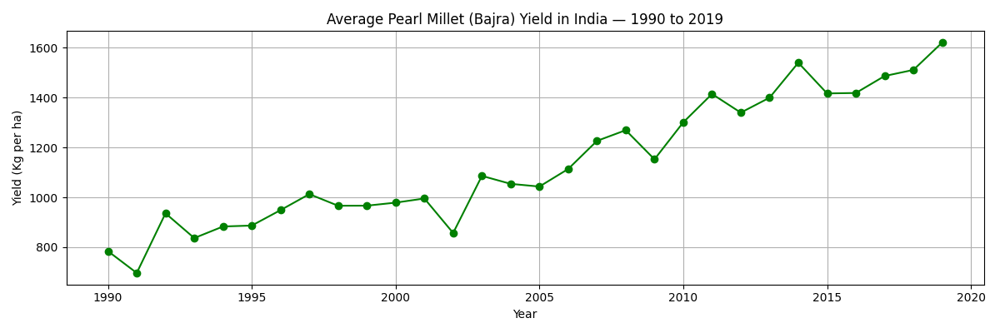
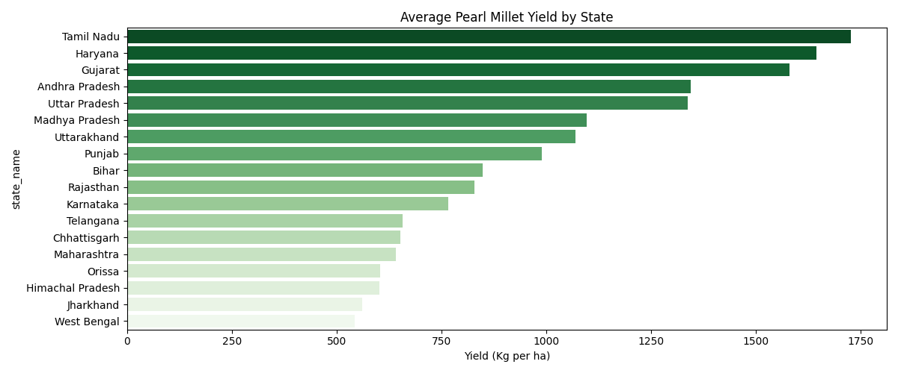
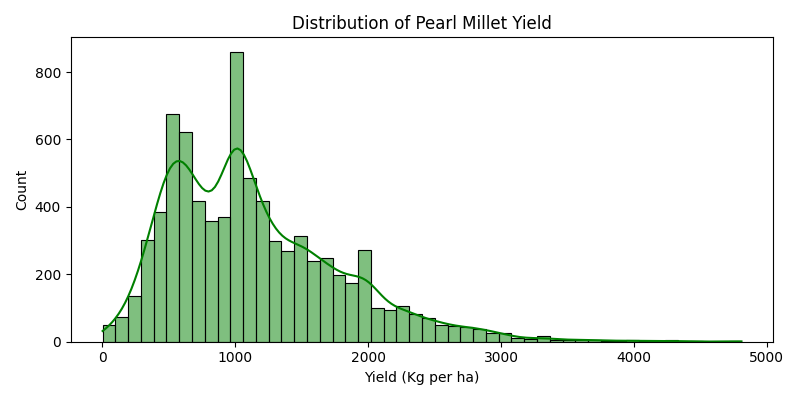
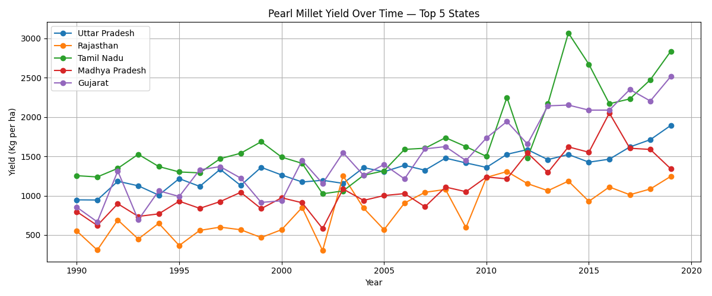

# Millet Yield Forecaster

District-level pearl millet yield prediction across India using XGBoost with SHAP explainability and a tool-augmented LLM chatbot.

**Live Demo:** [millet-yield-forecaster.vercel.app](https://millet-yield-forecaster.vercel.app)

---

## Motivation

This project started from a question that stuck after reading my professor's article, "From Green Revolution to Millet Revolution: understanding India's transition through agri-food policies" — how well has district-level yield growth actually been captured over these decades? Yield data existed, and there were studies predicting yields at the national or state level, but very few attempted district-level forecasting with real explainability.

As an undergraduate at IIT Kharagpur with an interest in AIML and policy, I wanted to build a model that doesn't just predict — it explains itself. That led to SHAP and Explainable AI (XAI), which attribute each prediction back to its input features so that the output is actionable, not a black box.

Given that this is a self-directed project, I scoped it to pearl millet (bajra) specifically because of its strong policy relevance — India declared 2023 the International Year of Millets, and bajra is the most widely cultivated millet in the country. The goal was to build something that genuinely answers a question I had, not just a demonstration of a technique.

## Data

Three datasets were merged into a unified analytical dataset of ~8,500 district-year records:

- **ICRISAT District Level Database** — crop production, area, and yield for 334+ districts
- **IMD Rainfall Data** — monthly and seasonal rainfall (June-September monsoon)
- **District Coordinates** — geocoded centroids for spatial context

## Exploratory Data Analysis

National average yield shows a clear upward trend from ~790 kg/ha in 1990 to ~1,620 kg/ha in 2019, roughly doubling over three decades. However, this growth is uneven across states.



Tamil Nadu, Haryana, and Gujarat lead in average yield, while states like West Bengal and Jharkhand lag significantly behind. This 3x gap between the highest and lowest-performing states suggests that local factors (soil, irrigation, rainfall patterns) matter far more than national trends.



The yield distribution is right-skewed with a bimodal shape — a primary cluster around 400-600 kg/ha (low-yield, rainfed districts) and a secondary peak near 1,000 kg/ha (higher-performing, irrigated districts). This bimodality motivated district-level modeling rather than a single national model.



Tracking the top 5 states over time reveals that Tamil Nadu pulled away dramatically after 2010, while Rajasthan remained consistently the lowest performer. Gujarat and Uttar Pradesh show strong convergence in recent years.



## Feature Engineering

Starting from raw crop and rainfall data, 16 features were engineered for the model:

**Temporal lag features** — These capture the autoregressive nature of crop yields, where a district's performance is heavily influenced by its recent history:
- `yield_lag1`, `yield_lag2`, `yield_lag3` — yield from the previous 1, 2, and 3 years
- `yield_rolling3` — 3-year rolling average yield
- `yield_yoy_change` — year-over-year yield change
- `area_lag1` — previous year's cultivated area

**Rainfall disaggregation** — Rather than using a single annual rainfall value, monsoon rainfall was broken down by month to capture timing effects:
- `rainfall_jun`, `rainfall_jul`, `rainfall_aug`, `rainfall_sep` — monthly monsoon rainfall
- `rainfall_kharif` — total Kharif season rainfall (Jun-Sep, the primary growing season for bajra)
- `rainfall_annual` — total annual rainfall

**Identifiers and spatial features:**
- `state_code`, `dist_code` — encoded geographic identifiers
- `year`, `area` — temporal and scale features

The strongest single predictor turned out to be `yield_lag1` (previous year's yield), confirming that district-level yields exhibit strong temporal persistence.

## Models

A sequential ablation study was conducted, progressively adding complexity:

| Model | R² | RMSE | What changed |
|-------|-----|------|-------------|
| XGBoost v1 | 0.961 | 152 | Baseline with all 16 features |
| XGBoost v2 | 0.974 | 118 | Hyperparameter tuning + rainfall interaction terms. Error reduced by 22% |
| LSTM v1 | 0.989 | 79 | Deep learning with temporal sequencing (sequence length = 1) |
| LSTM v2 | 0.997 | 43 | 3-year input sequence window to capture long-term temporal dependencies |

**Why XGBoost v2 was chosen for production despite LSTM v2 being the better model:**

LSTM v2 achieved near-perfect R² (0.997), but the production system needed real-time, per-request explainability. SHAP's TreeExplainer gives exact Shapley values for tree-based models in milliseconds. For deep learning, SHAP uses DeepExplainer or GradientExplainer, which are approximate and significantly slower — making them impractical for a user-facing dashboard that computes SHAP on every prediction request.

The trade-off was clear: slightly lower accuracy (R² 0.974 vs 0.997) in exchange for exact, fast, actionable explanations of every prediction.

## Explainability (SHAP)

Every prediction made by the dashboard comes with a SHAP breakdown showing which features pushed the yield estimate up or down. This is computed on-the-fly using SHAP's TreeExplainer for the district's most recent data point.

For example, a typical SHAP output for a district might show that high `yield_lag1` pushed the prediction up by +200 kg/ha, while below-average `rainfall_kharif` pulled it down by -80 kg/ha. This makes the model's reasoning transparent and actionable for agricultural stakeholders.

## Chatbot

The chatbot is a tool-augmented LLM agent, not a RAG system. The distinction matters: instead of retrieving chunks from a vector database and hoping the model interprets them correctly, the model is given a callable Python function and decides when to use it.

**Architecture:**

The agent is built on Google Gemini 2.5 Flash using its native function-calling API. A single tool, `fetch_district_data(district_name, year)`, is registered with the model. This function directly queries the in-memory Pandas DataFrame that the backend already holds for the ML service — no separate database, no vector embeddings, no retrieval pipeline.

**How a query flows:**

1. User sends a message (e.g., "What was the yield in Anantapur in 2010?")
2. The frontend sends the message + full conversation history to the `/chat` endpoint
3. The backend reconstructs the conversation as Gemini-compatible `Content` objects and sends it to the model
4. Gemini recognizes the query needs real data, pauses generation, and emits a function call: `fetch_district_data("Anantapur", 2010)`
5. The SDK automatically executes the Python function, which filters the DataFrame and returns the matching row (yield, rainfall, area, state average, previous year yield)
6. Gemini receives the function result and resumes generation, weaving the real numbers into a natural language response

The conversation is stateless on the server — full history is sent from the frontend on each request, rebuilt into Gemini's format, and discarded after the response. No sessions, no server-side memory.

**Scope control:**

The system prompt restricts the chatbot to millet agronomy, district-level yield data (1993-2019), and the project's ML methodology. It explicitly rejects questions about non-millet crops, live weather forecasts, and market prices. If the tool returns no data for a query, the model is instructed to relay that clearly rather than guess.

**Why not RAG:**

The dataset is structured tabular data (CSV rows), not unstructured text. RAG excels at retrieving passages from documents, but for precise numerical lookups ("yield in district X, year Y"), a direct function call against the DataFrame is simpler, faster, and guaranteed to return the exact value. There is no embedding step, no similarity search, and no risk of retrieving the wrong chunk.

## Tech Stack

- **ML:** XGBoost, SHAP, PyTorch (LSTM), Pandas, NumPy
- **Backend:** FastAPI, Uvicorn, Pydantic, SlowAPI
- **Frontend:** React, Vite, Recharts, Nivo
- **GenAI:** Google Gemini 2.5 Flash with function-calling
- **Deployment:** Vercel (frontend), Render (backend)

## Project Structure

```
├── backend/          # FastAPI API, ML inference, SHAP, chatbot agent
├── dashboard/        # React frontend (Vite)
├── data/             # Raw and processed datasets
├── models/           # Trained model artifacts (.pkl, .pt)
├── notebooks/        # Jupyter notebook — EDA, feature engineering, ablation
├── charts/           # EDA visualizations
└── README.md
```

## Run Locally

**Backend:**
```bash
cd backend
pip install -r requirements.txt
# Create .env with GEMINI_API_KEY=your_key
uvicorn api:app --reload
```

**Frontend:**
```bash
cd dashboard
npm install
npm run dev
```

Open `http://localhost:5173`.

## Deployment

| Component | Platform | URL |
|-----------|----------|-----|
| Frontend | Vercel | [millet-yield-forecaster.vercel.app](https://millet-yield-forecaster.vercel.app) |
| Backend | Render | [millet-yield-forecaster.onrender.com](https://millet-yield-forecaster.onrender.com) |

Note: Render free tier cold-starts after inactivity. First request may take 30-60 seconds.
